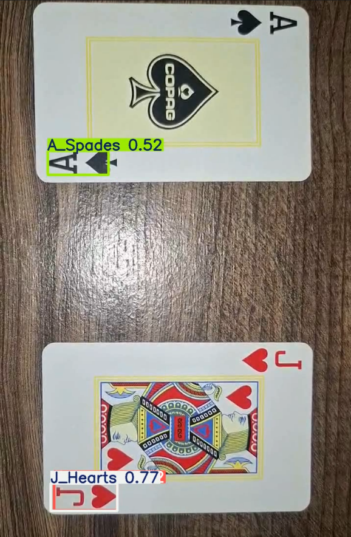

# Detecção de Cartas de Baralho com YOLO

Sistema de detecção de cartas de baralho utilizando YOLO. O modelo identifica cartas em vídeos, desenha as caixas de detecção e informa a classe reconhecida, considerando valor e naipe da carta.

## Dataset

Foi utilizado um dataset público do Kaggle contendo imagens rotuladas de cartas de baralho no formato YOLO.

Link do dataset: https://www.kaggle.com/datasets/artemzysko/playing-cards-dataset-yolo-object-detection

O modelo foi treinado para reconhecer 52 classes, correspondentes às combinações entre valores e naipes das cartas de baralho.

## Tecnologias utilizadas

* Python
* Ultralytics YOLO
* OpenCV
* Google Colab
* Kaggle

## Estrutura do repositório

```text
├── env/
├── resultados/
├── videos/
├── evidencias/
├── .gitignore
├── best.pt
├── detectar.py
├── README.md
└── requirements.txt
```

## Como executar

Instale as dependências:

```bash
pip install -r requirements.txt
```

Execute o script de detecção:

```bash
python detectar.py
```

Por padrão, o script utiliza os vídeos presentes na pasta `videos/` e salva os resultados na pasta `resultados/`.

Para testar com outro vídeo, adicione o arquivo desejado na pasta `videos/` e altere no código o caminho da variável `VIDEO_INPUT`. Exemplo:

```python
VIDEO_INPUT = "videos/meu_video.mp4"
```

Após a execução, o vídeo processado será salvo na pasta:

```text
resultados/
```

## Reprodução do vídeo

Ao executar o arquivo `detectar.py`, o vídeo analisado começará a ser reproduzido em uma janela com as detecções realizadas pelo modelo.

Para encerrar a reprodução antes do fim do vídeo, pressione a tecla `Q`.

## Modelo treinado

O arquivo `best.pt` é o modelo usado para detectar cartas nos vídeos.

## Métricas obtidas

| Métrica      | Valor |
| ------------ | ----: |
| Precision    | 0.927 |
| Recall       | 0.892 |
| mAP@0.5      | 0.963 |
| mAP@0.5:0.95 | 0.900 |

## Resultados

A pasta `resultados/` contém os resultados gerados para cada vídeo de exemplo presente na pasta `videos/`.

## Evidências das Predições

A seguir são apresentados exemplos de detecções realizadas pelo modelo em vídeos reais utilizados durante a validação prática.

### Exemplo 1 – Ás de Espadas e Valete de Copas



### Exemplo 2 – Rei de Ouros e Dama de Paus


